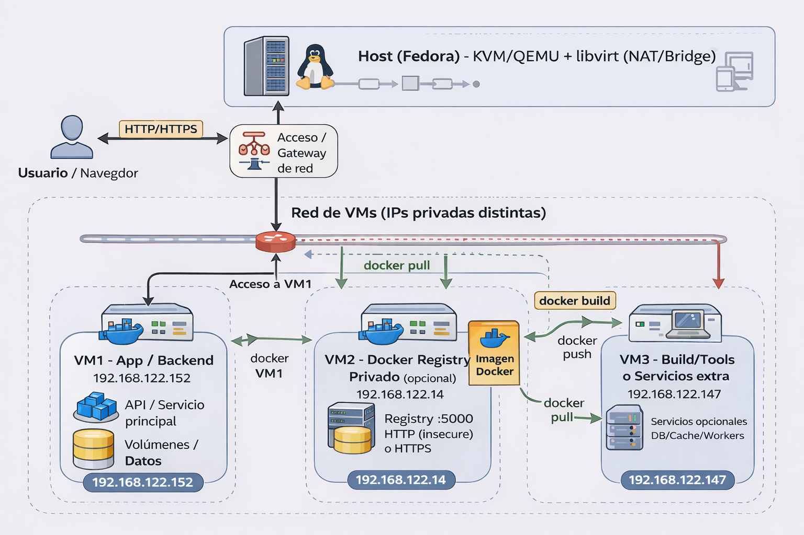
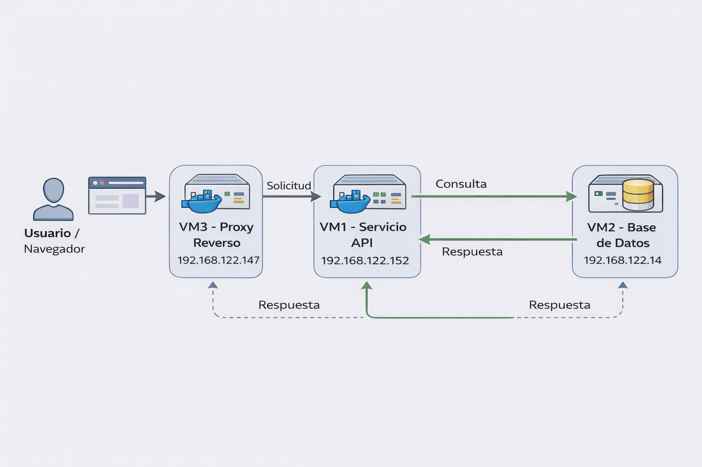
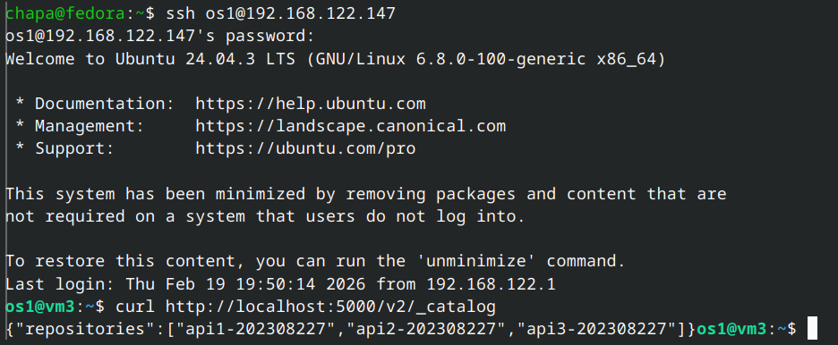
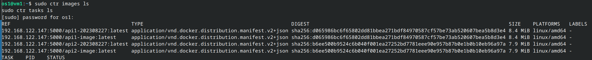
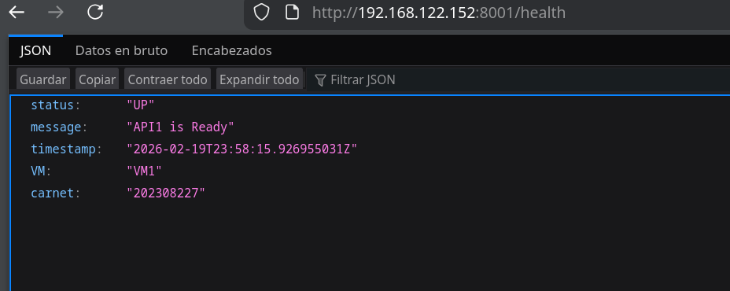
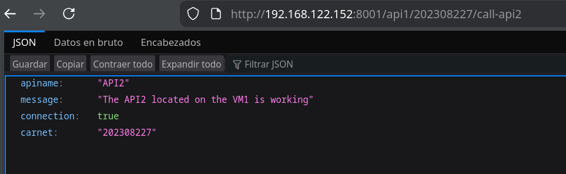
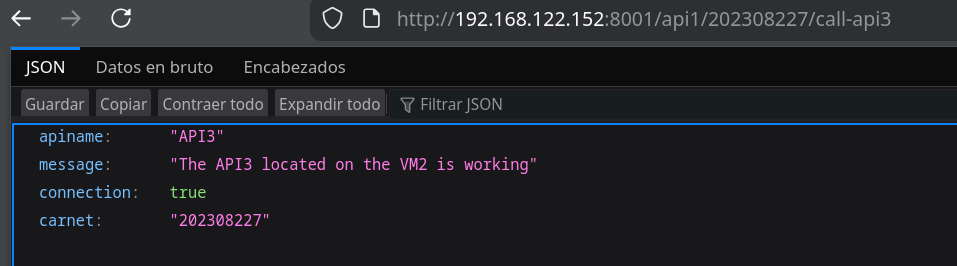

# Manual Técnico - Proyecto 1

- Universidad de San Carlos de Guatemala
- Facultad de Ingeniería - Escuela de Ciencias y Sistemas
- Curso: Sistemas Operativos 1
- Estudiante: Christian David Chinchilla Santos
- Carnet: 202308227

## 1. Descripción del Proyecto

El presente proyecto implementa un sistema de arquitectura de microservicios distribuidos. Se compone de tres APIs desarrolladas en Go (Golang) que se comunican entre sí a través de peticiones HTTP. La infraestructura está virtualizada utilizando KVM, distribuyendo los servicios en tres máquinas virtuales distintas para separar el entorno de almacenamiento de imágenes (Registry) del entorno de ejecución (Runtime).

## 2. Arquitectura del Sistema

El sistema está distribuido en tres Nodos (Máquinas Virtuales) principales:
- VM3 (Almacenamiento/Registry - IP: 192.168.122.147): Actúa como el servidor de distribución. Utiliza Docker para ejecutar un contenedor de Zot, el cual funciona como un registro privado (Private Registry) en el puerto 5000 para almacenar las imágenes generadas.

- VM1 (Gateway y Servicio Local - IP: 192.168.122.152): Utiliza Containerd como runtime de contenedores. Ejecuta dos microservicios:

- API 1 (Puerto 8001): Funciona como API Gateway. Recibe las peticiones iniciales y orquesta las llamadas hacia las otras APIs.

- API 2 (Puerto 8002): Microservicio local que responde a las peticiones de la API 1 dentro del mismo nodo.

- VM2 (Servicio Remoto - IP: 192.168.122.14): Utiliza Containerd como runtime. Ejecuta un microservicio:

- API 3 (Puerto 8003): Microservicio remoto que responde a las peticiones de la API 1 a través de la red de KVM.




## 3. Flujo de Comunicación

El flujo de datos está diseñado para probar la comunicación tanto local como remota:

- Health Check Base: El cliente hace una petición GET a /health en la API 1. La API 1 responde con su estado y el carnet del desarrollador en formato JSON.

- Comunicación Interna (Localhost): El cliente hace una petición GET a /api1/202308227/call-api2. La API 1 realiza una petición HTTP interna hacia la API 2 (puerto 8002) en la misma VM. La API 1 procesa la respuesta y se la devuelve al cliente.

- Comunicación Externa (Red KVM): El cliente hace una petición GET a /api1/202308227/call-api3. La API 1 sale a la red virtualizada y realiza una petición HTTP hacia la IP de la VM2 (puerto 8003). Retorna el estado de éxito al cliente.



## 4. Configuración Detallada
### 4.1. Configuración del Registro Zot (VM3)

Se detuvo el servicio local por defecto y se implementó Zot como registro privado de imágenes alojado en la red local.

```bash
# Descarga y ejecución de Zot en el puerto 5000
sudo docker run -d -p 5000:5000 --restart=always --name zot-registry ghcr.io/project-zot/zot-linux-amd64:latest
```

### 4.2. Construcción y Etiquetado de Imágenes

Las APIs fueron programadas en Go. Para la creación de imágenes se utilizó un Dockerfile de tipo multi-stage build (usando golang:1.23-alpine para compilar y alpine:latest para ejecutar), optimizando el tamaño final a ~16MB.

``` bash
# Ejemplo de construcción y etiquetado con nomenclatura solicitada
sudo docker build -t api1-image .
sudo docker tag api1-image localhost:5000/api1-202308227:latest
sudo docker push localhost:5000/api1-202308227:latest
```



### 4.3. Despliegue en Entorno de Producción (VM1 y VM2)

Para el despliegue no se utilizó Docker, sino directamente containerd a través de su cliente de consola ctr, descargando las imágenes en texto plano desde el registro Zot y ejecutándolas en la red del host (--net-host).

``` bash
#comando utilizado en los nodos para descargar y ejecutar
sudo ctr images pull --plain-http 192.168.122.147:5000/api1-202308227:latest
sudo ctr run -d --net-host 192.168.122.147:5000/api1-202308227:latest api1
``` 


## 5. Pruebas de Validación y Endpoints

A continuación, se presenta la evidencia de la correcta funcionalidad de la orquestación y comunicación entre microservicios.

### Endpoint 1: API Gateway Health Check
Ruta: http://192.168.122.152:8001/health



### Endpoint 2: Comunicación Local (API 1 a API 2)
Ruta: http://192.168.122.152:8001/api1/202308227/call-api2



### Endpoint 3: Comunicación Remota (API 1 a API 3)
Ruta: http://192.168.122.152:8001/api1/202308227/call-api3

