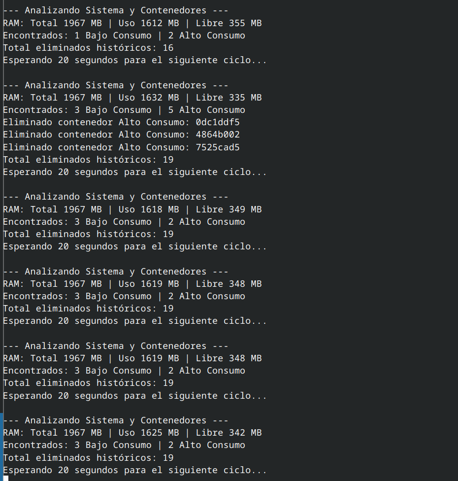
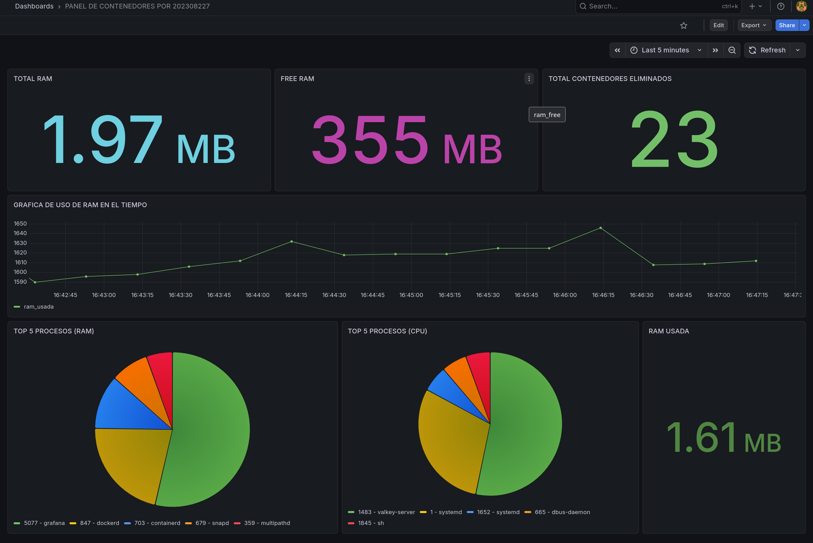

# Manual Técnico - Sistema de Monitoreo de Recursos y Gestión de Contenedores
**Proyecto 2 - Sistemas Operativos 1**

---

##  Información del Estudiante
* **Nombre:** Christian David Chinchilla Santos
* **Carnet:** 202308227
* **Institución:** Universidad de San Carlos de Guatemala
* **Fecha:** 19 de Marzo 2026

---

## 1. Introducción
Este proyecto consiste en una infraestructura de monitoreo de bajo nivel diseñada para el kernel de Linux. El sistema permite visualizar el consumo de memoria RAM y la lista de procesos activos, aplicando políticas de gestión automatizada sobre contenedores Docker para garantizar la estabilidad de la máquina virtual.

### Arquitectura del Sistema
El sistema se divide en tres capas principales:
1. **Capa de Kernel (C/Rust):** Extracción de métricas directas de las estructuras de datos del núcleo.
2. **Capa de Aplicación (Go):** Procesamiento de datos, persistencia en base de datos y toma de decisiones (Orquestador).
3. **Capa de Presentación (Grafana):** Visualización analítica de métricas en tiempo real.


---

## 2. Descripción de Componentes Técnicos

### 2.1 Módulo de Kernel (`continfo.c`)
Desarrollado en lenguaje C, este módulo crea un archivo en el sistema de archivos virtual `/proc`. Al ser consultado, recorre la lista circular de procesos (`task_struct`) y utiliza la función `si_meminfo` para obtener el estado de la memoria física.

* **Salida:** Formato JSON nativo para evitar sobrecarga de parsing en el Daemon.
* **Ubicación:** `/proc/continfo_pr2_so1_202308227`


### 2.2 Daemon Gestor (`main.go`)
El corazón del proyecto. Escrito en Go por su eficiencia en el manejo de concurrencia y llamadas al sistema. 

**Funciones Clave:**
- **Analizador:** Lee el archivo `/proc` cada 20 segundos.
- **Verdugo (Cleaner):** Compara el número de contenedores contra los límites establecidos (Max 3 bajo consumo, Max 2 alto consumo) y ejecuta `docker rm -f`.
- **Adaptador Valkey:** Formatea y envía los datos a la base de datos en memoria.

ejemplo
```go

//canal para capturar señales de interrupción del sistema
sigs := make(chan os.Signal, 1)
signal.Notify(sigs, syscall.SIGINT, syscall.SIGTERM)

go func() {
    sig := <-sigs
    fmt.Printf("\n[SIGNAL %v] Iniciando apagado seguro...\n", sig)
    
    //limpieza: Detener cronjobs y remover módulo
    exec.Command("sudo", "rmmod", "continfo").Run()
    exec.Command("crontab", "-r").Run()
    
    fmt.Println("Sistema limpio. ¡Adiós 202308227!")
    os.Exit(0)
}()
```

``` go 
  
func clasificarProcesos(procesos []Process, totalRam uint64) {
    for _, p := range procesos {
        
        porcentaje := (float64(p.RSS) / float64(totalRam)) * 100
        if porcentaje > 10.0 {
            fmt.Printf("\033[35m[CRITICAL] Proceso %s (PID: %d) consumiendo %.2f%% de RAM\033[0m\n", 
                p.Nombre, p.PID, porcentaje)
            
          
            rdb.LPush(ctx, "alertas_sistema", fmt.Sprintf("Crítico: %s consumiendo %.2f%%", p.Nombre, porcentaje))
            rdb.LTrim(ctx, "alertas_sistema", 0, 9) 
        }
    }
}
```

### 2.3 Actividad Extra (Rust Hybrid Module)
Se implementó un módulo utilizando las herramientas de **Rust for Linux** (`bindgen`, `llvm`). Debido a restricciones de las cabeceras del kernel genérico, se utilizó un cargador en C que actúa como interfaz para inyectar mensajes de autoría en el **Kernel Ring Buffer**.

ejemplo 
``` rust
if _, err := os.Stat("/proc/continfo_pr2_so1_202308227"); os.IsNotExist(err) {
    logEvento("El archivo /proc no existe. ¿Cargaste el módulo de Kernel?", true)
    return
}
```
---

## 3. Guía de Instalación y Configuración

3.1 Requisitos Mínimos

    Kernel: 6.8.0-101-generic (o superior).

    Dependencias: Docker Engine, Valkey-server, Go 1.22+.

3.2 Pasos para el Despliegue

    Compilar el Módulo: Ejecutar make en la carpeta del módulo para generar el archivo .ko.

    Iniciar Base de Datos: docker run -d --name valkey_db -p 6379:6379 valkey/valkey.

    Iniciar Visualización: docker run -d --name grafana_dashboard -p 3000:3000 grafana/grafana.

    Ejecutar Orquestador: sudo go run main.go dentro de la carpeta del proyecto.


## 4. Evidencia de Funcionamiento
### 4.1 Monitoreo en Tiempo Real (Terminal)

En esta sección se observa cómo el Daemon identifica el exceso de contenedores de alto consumo y procede a eliminarlos de forma atómica para liberar recursos.

   

### 4.2 Dashboard Analítico (Grafana)

El dashboard muestra el estado global. Se pueden apreciar los indicadores de RAM Total, RAM Libre y el contador histórico de contenedores eliminados. Las gráficas de pastel desglosan el TOP 5 de procesos que más impactan al sistema.

   

## 5. Conclusiones Técnicas

Optimización de Recursos: La lectura directa desde /proc evita el uso de herramientas pesadas como top o ps, reduciendo el overhead del monitoreo.

Resiliencia: El sistema es capaz de auto-gestionarse y recuperarse ante cargas de trabajo excesivas sin intervención humana.

Interoperabilidad: Se demostró la capacidad de comunicar lenguajes de bajo nivel (C) con lenguajes de alto nivel (Go) a través del sistema de archivos virtual de Linux.