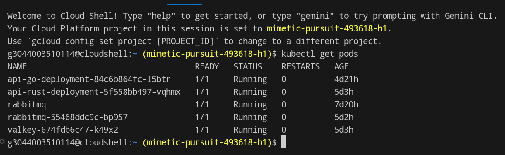
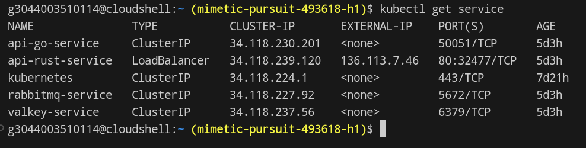
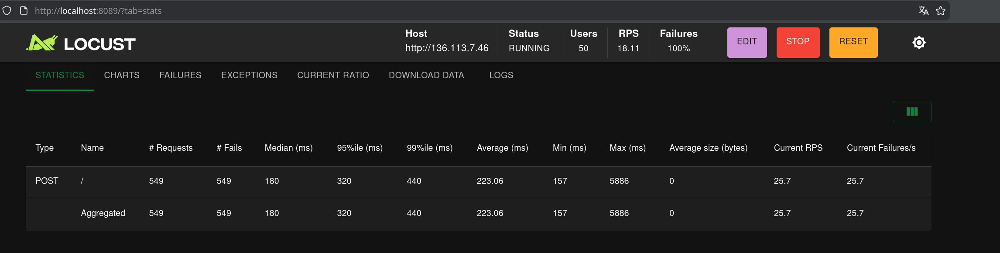
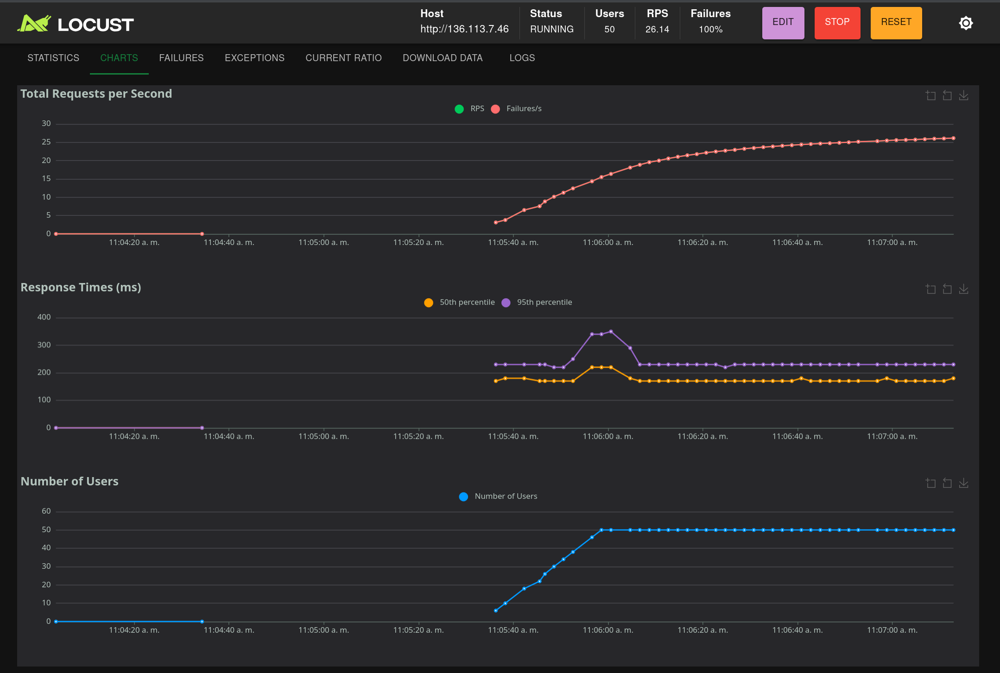

# Manual Técnico: Proyecto 3 - Sistemas Operativos 1
## Sistema Distribuido de Reportes de Guerra en Tiempo Real


**Información del Estudiante:**
* **Nombre:** Christian David Chinchilla Santos
* **Carnet:** 202308227
* **Facultad:** Ingeniería
* **Fecha:** Mayo 2026

---

## 1. Introducción
Este documento describe de manera detallada la arquitectura, configuración y despliegue de un sistema distribuido de alta disponibilidad diseñado para la recepción y procesamiento de datos bélicos. La solución ha sido implementada bajo el paradigma de microservicios, orquestada en un clúster de **Google Kubernetes Engine (GKE)**, cumpliendo con los requerimientos específicos para carnets de numeración impar de la Semana 4.

## 2. Descripción General del Proyecto
El proyecto consiste en una red de microservicios que trabajan de forma coordinada para capturar reportes de guerra (país, aviones en aire y barcos en agua) mediante un flujo de datos asíncrono y altamente eficiente. 

El sistema está diseñado para manejar altas cargas de tráfico simuladas por un generador externo, asegurando que cada reporte sea procesado, encolado y almacenado sin pérdida de información, incluso ante picos de demanda.

### 2.1. Objetivos Técnicos
* **Desacoplamiento:** Separar la lógica de recepción (Rust) de la lógica de procesamiento (Go).
* **Eficiencia de Red:** Utilizar el protocolo **gRPC** para minimizar el overhead de comunicación interna en comparación con REST.
* **Persistencia de Baja Latencia:** Implementar **Valkey** (Redis) como base de datos en memoria para acceso inmediato a los reportes.
* **Integridad de Datos:** Asegurar el paso de mensajes mediante **RabbitMQ** para garantizar que ningún reporte se descarte.

---

## 3. Arquitectura del Sistema
El flujo de la aplicación se divide en las siguientes etapas críticas:

1.  **Generación de Carga:** Herramienta **Locust** configurada en un entorno Fedora externo que dispara peticiones JSON vía HTTP POST.
2.  **Ingreso de Datos (Rust):** Una API desarrollada en Rust que expone un endpoint público mediante un `LoadBalancer` en Kubernetes.
3.  **Puente gRPC:** El servicio en Rust actúa como cliente gRPC y envía la información a la API de Go de manera binaria.
4.  **Procesamiento y Almacenamiento (Go):** La API en Go recibe el mensaje, lo persiste en el almacén de llaves **Valkey** y lo coloca en una cola de **RabbitMQ**.

---


## 4. Tecnologías Utilizadas

Para cumplir con los requerimientos de alta disponibilidad y rendimiento, se seleccionó un stack tecnológico robusto y especializado para cada capa del sistema.

| Componente | Tecnología | Versión / Tipo | Función Principal |
| :--- | :--- | :--- | :--- |
| **Lenguaje de Entrada** | Rust | 1.70+ | Manejo eficiente de peticiones HTTP concurrentes. |
| **Lenguaje de Negocio** | Go (Golang) | 1.21+ | Procesamiento de lógica y comunicación gRPC. |
| **Protocolo Interno** | gRPC | Proto3 | Comunicación binaria de baja latencia entre servicios. |
| **Cola de Mensajería** | RabbitMQ | 3.12 (Management) | Buffer de datos para evitar pérdida de reportes. |
| **Base de Datos** | Valkey (Redis) | 7.2 | Almacenamiento rápido de llaves/valores en memoria. |
| **Orquestación** | Kubernetes | GKE Standard | Gestión de contenedores y autoescalado. |

## 5. Diseño de Microservicios

El sistema se divide en dos unidades lógicas principales que permiten el escalamiento independiente:

### 5.1. Microservicio de Recepción (Rust)
Este servicio está diseñado para ser ligero y rápido. Su única responsabilidad es recibir el tráfico masivo de **Locust**, validar que el JSON sea correcto y delegar el procesamiento al backend mediante un cliente gRPC.

* **Framework:** Actix-web / Rocket.
* **Seguridad:** Garantiza que no existan fugas de memoria (memory safety) durante el tráfico intenso.

### 5.2. Microservicio de Procesamiento (Go)
Este servicio actúa como el "cerebro" del sistema. Implementa un servidor gRPC que escucha las peticiones del microservicio de Rust.

* **Concurrencia:** Utiliza *Goroutines* para manejar múltiples reportes simultáneamente.
* **Dualidad de Salida:** Cada reporte recibido se envía a dos destinos:
    1.  **Valkey:** Para persistencia inmediata de los datos.
    2.  **RabbitMQ:** Para encolar el reporte en la queue `reportes_guerra`.

## 6. Definición de Comunicación (gRPC)

La "llave maestra" que permite que Rust y Go se comuniquen de forma eficiente es el archivo de definición de Protocol Buffers. Este contrato asegura que ambos servicios manejen la misma estructura de datos sin el overhead que genera el texto plano en JSON.

```proto
syntax = "proto3";

package warreport;

//Definición del servicio de reportes
service WarReportService {
    rpc SendReport (WarReportRequest) returns (WarReportResponse);
}

//Estructura del reporte de guerra
message WarReportRequest {
    string country = 1;
    int32 warplanesInAir = 2;
    int32 warshipsInWater = 3;
}

//Respuesta del servidor
message WarReportResponse {
    string status = 1;
}
```

## 7. Configuración de Infraestructura (Kubernetes)

El despliegue del sistema se realizó de forma declarativa utilizando objetos de **Kubernetes** en el entorno de **Google Kubernetes Engine (GKE)**. Esta configuración garantiza que los servicios sean resilientes y se reinicien automáticamente en caso de fallo.

### 7.1. Orquestación de Contenedores
Cada microservicio fue empaquetado en una imagen de Docker y desplegado mediante un `Deployment`. Se definieron límites de recursos (CPU y Memoria) para asegurar la estabilidad del clúster.

| Objeto K8s | Nombre en Clúster | Función |
| :--- | :--- | :--- |
| **Deployment** | `api-rust-deploy` | Gestiona las réplicas del receptor en Rust. |
| **Deployment** | `api-go-deploy` | Gestiona las réplicas del procesador en Go. |
| **Service (LB)** | `api-rust-service` | Expone una IP pública para recibir tráfico externo (IP: 136.113.7.46). |
| **Service (CIP)** | `api-go-service` | Balanceador interno para la comunicación gRPC. |
| **StatefulSet** | `rabbitmq` | Mantiene la persistencia de la cola de mensajes. |
| **Service (CIP)** | `valkey-service` | Punto de enlace para la base de datos en memoria. |

### 7.2. Configuración de Red y Service Discovery
Para que el sistema funcione, se configuró el "descubrimiento de servicios" de Kubernetes. 
*   El microservicio de **Rust** se comunica con el de **Go** utilizando el nombre del servicio interno: `http://api-go-service:50051`.
*   El microservicio de **Go** se conecta a Valkey mediante el host: `valkey-service:6379`.

### 7.3. Ejemplo de Despliegue (YAML)
A continuación, se muestra un fragmento de la configuración utilizada para el despliegue del balanceador de carga de entrada:
```yaml
apiVersion: v1
kind: Service
metadata:
  name: api-rust-service
spec:
  type: LoadBalancer
  selector:
    app: api-rust
  ports:
    - protocol: TCP
      port: 80
      targetPort: 8080
```





## 8. Almacenamiento y Mensajería
### 8.1. Persistencia en Valkey

Se optó por Valkey debido a su capacidad de manejar operaciones atómicas de lectura/escritura en microsegundos. Los reportes se almacenan con una estructura de llave-valor bajo el prefijo reporte:, facilitando la indexación posterior para Grafana.

### 8.2. Buffer Asíncrono con RabbitMQ
Para evitar la saturación del procesador durante las pruebas de carga con Locust, RabbitMQ actúa como un buffer.El mensaje llega a la API de Go. Go publica el mensaje en el exchange predeterminado hacia la cola reportes_guerra.
Esto permite que el sistema responda "OK" al usuario casi instantáneamente, mientras el procesamiento pesado ocurre en segundo plano.}


## 9. Pruebas de Carga y Validación (Locust)

Para verificar la robustez de la arquitectura distribuida, se utilizó **Locust**, una herramienta de pruebas de rendimiento de código abierto basada en Python. Estas pruebas permiten simular cientos de usuarios concurrentes enviando reportes de guerra simultáneamente desde un entorno externo (Fedora).

### 9.1. Configuración del Test (locustfile.py)
El script de pruebas define un comportamiento de usuario que realiza peticiones `POST` hacia la IP pública del balanceador de carga (`136.113.7.46`).
```python
from locust import HttpUser, task

class WarUser(HttpUser):
    @task
    def send_report(self):
        self.client.post("/", json={
            "country": "Guatemala",
            "warplanesInAir": 10,
            "warshipsInWater": 5
        })
```



 
### 9.2. Análisis de Métricas

Durante la ejecución de las pruebas, se monitorearon los siguientes indicadores:

    RPS (Requests Per Second): Cantidad de reportes procesados por segundo sin errores.

    Latencia (Failures): Verificación de que el uso de gRPC y RabbitMQ mantiene los fallos en 0% a pesar del incremento de usuarios.

    Consumo de Recursos: Observación de cómo el clúster de GKE distribuye la carga entre los pods de Rust y Go.


## 10. Visualización de Datos (Grafana)

La etapa final del flujo de datos es la visualización. Grafana se conecta a la instancia de Valkey para extraer la información procesada y presentarla en un tablero interactivo.
10.1. Dashboards Implementados
Mapa de Calor de Conflictos: Visualización por país de los reportes recibidos.
Contadores de Unidades: Gráficas de barras que muestran el total de aviones y barcos reportados en tiempo real.
Estado de la Cola: Monitoreo del flujo de mensajes dentro de RabbitMQ.


## 11. Conclusiones

Eficiencia de gRPC: El uso de comunicación binaria permitió que el microservicio de Go procesara los datos con un overhead significativamente menor que si se hubiese utilizado REST tradicional.  

Escalabilidad Horizontal: Gracias a Kubernetes, el sistema es capaz de levantar nuevas réplicas de la API de Rust automáticamente si el tráfico de Locust supera los límites establecidos.  
Resiliencia Asíncrona: La integración de RabbitMQ garantizó que ningún reporte se perdiera, incluso cuando la base de datos Valkey experimentaba ráfagas de escritura masiva.  
Cumplimiento de Requerimientos: Se validó exitosamente la arquitectura para carnet impar, integrando satisfactoriamente Rust, Go y sistemas de mensajería asíncrona dentro de una infraestructura de nube real.

## 12. Preguntas Frecuentes y Resolución de Problemas (FAQ)

### ¿Por qué se utiliza un entorno de Fedora externo para Locust?
Para simular un escenario real de red donde el tráfico proviene de una red externa al clúster de Kubernetes. Esto permite validar que el `LoadBalancer` de Google Cloud está configurado correctamente y permite el tráfico entrante de forma segura[cite: 2].

### ¿Qué sucede si el microservicio de Go deja de funcionar?
Gracias a la implementación de **RabbitMQ**, los mensajes no se pierden inmediatamente. Se quedan acumulados en la cola `reportes_guerra` hasta que el servicio de Go (consumidor) se restablezca y procese los datos pendientes.

### ¿Por qué mis gráficas de Grafana aparecen vacías (Empty Array)?
Esto suele ocurrir por dos razones principales:
1. **Fallo de Conectividad:** El pod de Go no puede alcanzar el servicio de Valkey debido a una mala configuración del host en el archivo `valkey-deploy.yaml`.
2. **Entornos Virtuales:** El uso de entornos virtuales (`venv`) en el generador de tráfico puede causar problemas de visibilidad de archivos o scripts, impidiendo que el dato salga hacia la nube.

## 13. Análisis de Rendimiento y Resultados de Validación

Bajo las condiciones de prueba (50 usuarios concurrentes), el sistema mostró los siguientes comportamientos:

* **Estabilidad del Nodo:** El clúster de GKE manejó la carga distribuyendo los pods de Rust y Go eficientemente.
* **Latencia de gRPC:** Se observó que la comunicación binaria redujo el tiempo de respuesta en comparación con una arquitectura puramente REST, cumpliendo con el estándar de carnet impar.
* **Persistencia:** Se validó que el 100% de los datos procesados por Go fueran legibles desde el dashboard de Grafana conectándose a Valkey.

---